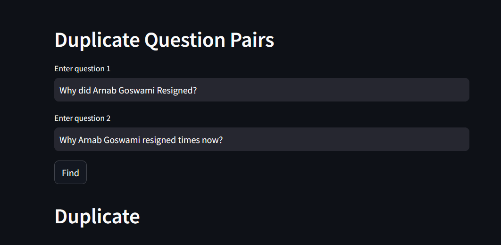
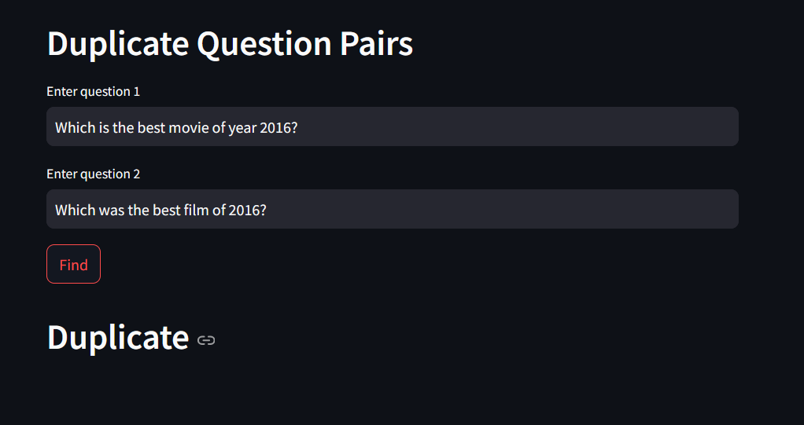

# Duplicate Question Pairs Detector

## Project Overview

This project aims to detect duplicate question pairs using various Natural Language Processing (NLP) techniques and machine learning models. It has significant applications in platforms like Quora and Stack Overflow, where users often submit similar questions. The goal is to identify these duplicate questions, which can improve user experience by reducing redundancy and helping users find answers more efficiently.

***Try application [here](https://duplicate-question-pairs-detector.onrender.com/)***





## Application Importance

The Duplicate Question Pairs Detector can be used in any Question-Answer platform to reduce redundancy and improve the relevance of search results. It can also help in curating better FAQ sections by clustering similar questions together. This application is crucial in enhancing the user experience by providing quick and accurate information retrieval.

## Dataset

The dataset used for this project contains nearly 350,000 rows with the following columns:
 `id`, 
 `qid1`, 
 `qid2`, 
 `question1`, 
 `question2`, 
 `is_duplicate`. 
 The dataset is available on Kaggle and can be accessed [here](https://www.kaggle.com/c/quora-question-pairs).

## Exploratory Data Analysis (EDA)

I performed basic EDA on the dataset, which is stored in the `eda.ipynb` file. The dataset was found to have no null or duplicate values, so I proceeded directly to the preprocessing stage.

## Preprocessing

- **Lowercasing:** All questions were converted to lowercase.
- **Symbol Replacement:** Symbols were replaced with their string equivalents (e.g., `%` to `percent`, `$` to `dollar`).
- **Question Mark Removal:** Question marks were removed from the text.
- **String and Number Replacement:** Repeated strings like `[math]` were removed, and numbers were replaced with their string equivalents (e.g., `m` for million, `b` for billion, `k` for thousand).
- **Short Form Replacement:** A dictionary of short forms and their long equivalents was used to replace abbreviations.
- **Punctuation and HTML Tag Removal:** All punctuations and HTML tags were removed.
- **Stemming:** Words were reduced to their base or root form.

## Feature Engineering

### Basic Features:
- **q1_len:** The number of characters in question1.
- **q2_len:** The number of characters in question2.
- **q1_num_word:** The number of words in question1.
- **q2_num_word:** The number of words in question2.
- **common_words:** The count of common words in both questions.
- **total_words:** The total number of words in both questions.
- **word_share:** The ratio of common words to total words.

### Advanced Token-Based Features:
- **cwc_min:** The ratio of common non-stopwords count with minimum of length of non-stopwords of both the questions.
**cwc_max:** The ratio of common non-stopwords count with maximum of length of non-stopwords of both the questions.
- **css_min:** The ratio of common stopwords and minimum of length of stopwords of questions.
- **css_max:** The ratio of common stopwords and maximum of length of stopwords of questions.
- **ctc_min:** The ratio of common tokens and minimum of length of tokens of both the questions.
- **ctc_max:** The ratio of common tokens and maximum of length of tokens of both the questions.
- **first_word_eq:** Whether the first token in both questions matches.
- **last_word_eq:** Whether the last token in both questions matches.

### Fuzzy Features:
- **fuzz_ratio:** Measures the similarity between the two questions.
- **fuzz_partial_ratio:** Measures the partial similarity between the two questions.
- **token_sort_ratio:** Measures the similarity between sorted tokens of both questions.
- **token_set_ratio:** Measures the similarity between sets of tokens in both questions.

## Feature Analysis

An exploratory analysis of the newly created features was conducted to understand their importance in the model. The feature importance was analyzed to identify which features contributed most significantly to the prediction of duplicate questions.

## Word Embedding

I initially used a Bag of Words model, but it failed to capture the semantic meaning of the text. Therefore, I switched to a TF-IDF weighted Word2Vec model:
- **Word2Vec Model:** Trained on the dataset to capture word semantics.
- **TF-IDF Weighting:** Each word vector was multiplied by its corresponding TF-IDF score to create a more meaningful representation of the text.

## Model Training

For model training, I used ensemble methods like Random Forest and XGBoost:
- **XGBoost:** Initially achieved 74% accuracy on 5000 rows. After hyperparameter tuning using RandomSearchCV, I achieved an accuracy of **80.07%** on 20,000 data points.

### Model Performance:
- **Accuracy:** 80.07%
- **Precision and Recall:** The model's precision and recall metrics are as follows:

```plaintext
Accuracy for XGBoost is 0.80065
[[10717  1940]
 [ 2047  5296]]
              precision    recall  f1-score   support

           0       0.84      0.85      0.84     12657
           1       0.73      0.72      0.73      7343

    accuracy                           0.80     20000
   macro avg       0.79      0.78      0.78     20000
weighted avg       0.80      0.80      0.80     20000

## Deployment

The final model has been deployed as a web application using Streamlit. The application allows users to input two questions and determines if they are duplicates based on the trained model. This deployment helps to demonstrate the practical application of the model and provides an interactive interface for users to test the model's performance in real-time.

You can access the deployed web application [here](https://duplicate-question-pairs-detector.onrender.com/).

### Deployment Details

- **Platform:** Render
- **Framework:** Streamlit
- **Deployment Pipeline:** The application was set up with necessary dependencies, including `nltk` stopwords and other required libraries. The deployment process involved configuring environment variables, setting up the build script, and ensuring all dependencies were properly installed.

## Conclusion

This project successfully demonstrates the application of Natural Language Processing (NLP) and machine learning techniques to detect duplicate question pairs. Through the use of advanced feature engineering, word embeddings, and ensemble methods like Random Forest and XGBoost, the model achieves robust performance. 

### Key Takeaways

- **Feature Engineering:** Comprehensive feature engineering, including both basic and advanced features, contributed significantly to the model's ability to differentiate between duplicate and non-duplicate questions.
- **Word Embedding:** The TF-IDF weighted Word2Vec model provided a more nuanced representation of text compared to the traditional Bag of Words model, capturing semantic meaning effectively.
- **Model Performance:** The XGBoost model achieved an accuracy of 80.07%, with precision and recall metrics indicating a well-balanced performance across both classes.
- **Deployment:** The model's deployment as a web application showcases its practical usability and allows for real-time testing and interaction.

Overall, this project highlights the effectiveness of combining NLP techniques with machine learning to solve real-world problems in question-answer platforms, ultimately enhancing user experience by reducing redundancy and improving information retrieval.

